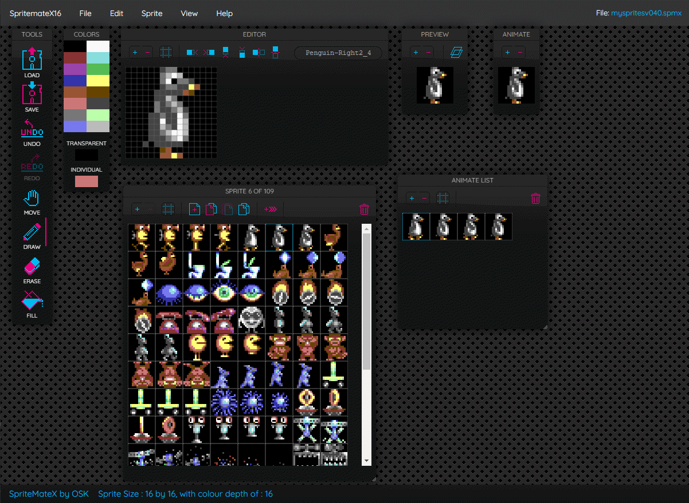

# SpritemateX
SpritemateX is a new sprite editor for the Commander X16 based on the source for SpriteMate for the Commodore 64 (https://github.com/Esshahn/spritemate). It works with most modern browsers on Windows, Mac and Linux and is pure JavaScript and HTML - no plugins. All data is processed on client side only. 

SpritemateX is still in development. If you like it, let me know ;) Feel free to submit pull requests or submit ideas, bugs, requests in the issues section. Cheers!

Latest stable version: https://burghwallis.com/spritematex/



## Features
* choose sprite size, from 16x16 to 64x64 in any combo (e.g. 32x16)
* choose tile size, from 8x8 to 16x16.
* choose 2 colour, 4 colour and 16 colour
* defaults to commander X16 palette, but has a C64 palette mode.
* delete, fill, shift left, right, up, down, flip horizontal & vertical, move, erase
* check your sprite in the preview window
* display grid in editor
* multiple sprites
* stacked sprite layers (sprite overlays)
* sprite sorting
* undo & redo
* copy, paste, duplicate
* window based GUI
* save window layout
* import & export SpritemateX format
* export as ASM source (KICK and ACME) as hex notation source
* import / export binary files
* keyboard shortcuts
* one animation set, to test out your animation frames

## Install & Dependencies

You can use `yarn` to run this project locally

```
$ cd spritematex
$ yarn
$ yarn run dev

```

Or use `npm`

```
$ cd spritematex 
$ npm install
$ npm run dev

```


## Menu toolbar

| Symbol        | Shortcut      | Function  |
| :-------------: | ------------- | --------------- |
|  | - | Loads a file.<br>Supported formats: SpritemateX (SPMX) |
|  | - | Saves a file.<br>Supported formats: SpritemateX (SPMX), Kick / ACME / XCI ASM source (ASM), Binary (BIN) |
|  | z | Undo. For when you screwed up. |
|  | shift + z | Redo. For when you realized it wasn't that bad |
|  | d | Draw pixels |
|  | f | Flood fill |
|  | e | eraser |
|  | m | move |

## Editor window

| Symbol        | Shortcut      | Function  |
| :-------------: | ------------- | --------------- |
|  | - | Shift sprite left |
|  | - | Shift sprite right |
|  | - | Shift sprite up |
|  | - | Shift sprite down |
|  | - | Flip sprite horizontal |
|  | - | Flip sprite vertical |
|  | - | Toggles grid display on/off |
|  | - | Zooms window in/out |
|  | 1,2 | Select individual color, transparent |
|  | shift + mouse | delete pixel |

## Preview window

| Symbol        | Shortcut      | Function  |
| :-------------: | ------------- | --------------- |
|  | - | Overlay next sprite |
|  | - | Zooms window in/out |

## Sprite list window

| Symbol        | Shortcut      | Function  |
| :-------------: | ------------- | --------------- |
|  | - | Create new sprite |
|  | - | Delete selected sprite |
|  | - | Copy sprite |
|  | - | Paste sprite |
|  | - | Toggles grid display on/off |
|  | - | Adds Sprite to Animation Set |
|  | - | Zooms window in/out |
| | cursor left & right | cycle through sprite list |

## Animation window

| Symbol        | Shortcut      | Function  |
| :-------------: | ------------- | --------------- |
|  | - | Zooms window in/out |

## Animation Set window

| Symbol        | Shortcut      | Function  |
| :-------------: | ------------- | --------------- |
|  | - | Toggles grid display on/off |
|  | - | Zooms window in/out |
|  | - | Delete selected sprite |

## Some useful hints

* Rearrange sprites by dragging them to the desired position
* Save a sprite as PNG by right clicking on the Preview window image


## Changelog

### V0.4
#### Added Animation Set.

- Added the ability to animate a set of sprites.
- Organise the animated frames.
- Add / Remove Frames from animation set.
- and all the "Normal" windowy type functions, like Zoom and border.

### V0.39
#### Added Ability To Increase Colour Depth.

### V0.38
#### Added Exporting of Binary Files.

### V0.37
#### Added Importing of Binary Files.

### V0.35
#### Added Sprite and Tile Layout to Assembly Export.

### V0.34
- Added Project Types (Sprite / Tile)
- Added Export of Assets, Pallets or Both

### V0.33
- Fixed Duplication Sprite naming bug
- Removed the importing of SPD C64 Files

### V0.32
- Fixed Drawing Issue
- Added XCI Export

### V0.30
- Commented out remaining C64 specific code.
- Added X16 stye pallet notation #FFF (#RedGreenBlue) single digits
- Added Project Information to status bar

### V0.20
- Added Commander X16 16 Colour Palettes.
- Added size specification on New
- Added Colour Depth on New
- Removed Multi Colour Toggles
- Invert function only for colour depths 2 and 4
- Removed Double Height and Double Width

### V0.10
- Added the ability to individually assign pixels a colour from the palette.
- Added specifying the asset size when using "New".
- Added export to Kick and ACME with the new format.
- created a new file standard called *.spmx.

Based on the Original Source Code for the Commodore 64 : https://github.com/Esshahn/spritemate (http://www.spritemate.com)
